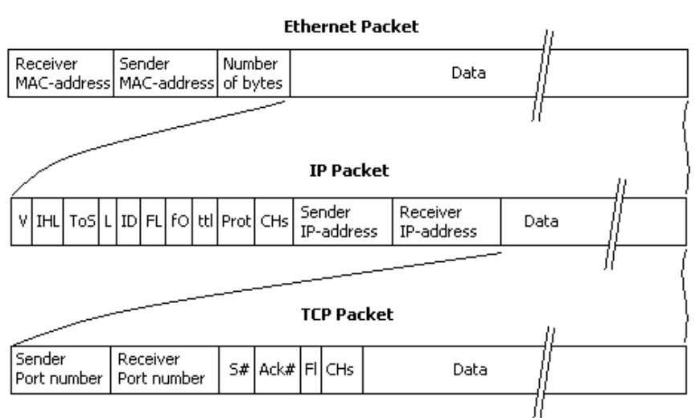

# Cybersecurity and National Defence Ex. 4 
## A.Y. 2025/2026

### Contacts
* **Flavio Ciravegna:** [*flavio.ciravegna@polito.it*]
* **Silvia Sisinni:** [*silvia.sisinni@polito.it*]
* **Enrico Bravi:** [*enrico.bravi@polito.it*]
* **Lorenzo Ferro:** [*lorenzo.ferro@polito.it*]

---

## Overview

This laboratory focuses on an introduction to network fundamentals and practical networking operations. We will cover the concepts of packets, how network scanning and sniffing work, and the role of encryption in mitigating sniffing attacks. Additionally, we will gain hands-on experience using key command-line utilities such as `ping` and `nmap`.

---

## 1. Network Fundamentals

### Network Interfaces
A **Network Interface** is the point of interconnection between a computer and a private or public network. It can be a physical hardware component (like an Ethernet port or a Wi-Fi adapter) or a virtual one (like the loopback interface `127.0.0.1` used for local testing). 
Without an interface, a device has no physical or logical path to transmit or receive data. Every interface acts as the definitive gateway through which network packets enter and exit the operating system.

### Network Ports
While an IP address identifies a specific *machine* on a network, a **Network Port** is a logical software construct used to identify a specific *process or application* running on that machine. Ports are numbered from 0 to 65535.
A single server might simultaneously host a web server, an email service, and a database. When a packet arrives at the server, the operating system must know exactly which running application should receive the payload. It achieves this by examining the destination port number (e.g., Port 80 for HTTP Web traffic, Port 22 for SSH management).

### What is a Packet?
A network packet is a formatted unit of data carried across a packet-switched network. Instead of sending large continuous streams of data, modern networks break information down into smaller, manageable chunks called packets. A packet typically consists of control information (such as the source/destination IPs in the **header**) and the user data (the **payload**).




### How is it Delivered?
Packets traverse networks via protocols like the Internet Protocol (IP). To successfully route these packets from a user's browser to a remote server, several mechanisms must coordinate:

#### 1. IP Addresses and Routing
Every device directly connected to an IP network requires a unique **IP address** to send and receive packets, acting similarly to a postal address. 
When a packet leaves your computer, it reaches a router. The router examines the destination IP address and uses routing tables to forward the packet hop-by-hop across intermediate routers until it arrives at the destination and is reassembled.

#### 2. The Domain Name System (DNS)
*   **The Problem:** Humans are not well-suited to memorize numeric strings like `142.250.184.206` for every single website they want to visit.
*   **The Justification / Solution:** DNS acts as the internet's decentralized phonebook. Before a packet is even formed, when you attempt to reach a domain like `google.com`, the system automatically queries a DNS server to translate that human-readable name into its exact destination IP address needed for standard routing.
*   **Viewing the DNS Cache:** Operating systems temporarily cache DNS queries. You can view this cache in Windows using `ipconfig /displaydns`. On modern Linux, you can view resolution statistics using `resolvectl statistics`.
*   **Overriding DNS:** You can manually bypass external DNS resolution by editing the local **hosts file** (`/etc/hosts` on Linux/macOS, or `C:\Windows\System32\drivers\etc\hosts` on Windows). This forces the OS to map a specific domain to an IP address of your choosing.

#### 3. Address Resolution Protocol (ARP)
*   **The Problem:** While IP addresses handle logical global routing, they are software constructs that cannot physically carry electrical signals down an Ethernet cable. Actual, localized delivery on a physical network segment (such as reaching the router from your laptop) strictly requires a physical **MAC (Media Access Control) address**.
*   **The Justification / Solution:** Devices use ARP to bridge the logical IP world with the physical MAC hardware. If a computer needs to route a packet locally, it consults an **ARP Table**—a local directory mapping known IP addresses to their corresponding physical MAC addresses—ensuring the hardware frame successfully jumps to the correct device.
*   **Viewing the ARP Table:** You can view the current MAC-to-IP mappings on your system by running the command `arp -a` (on both Linux and Windows) or `ip neigh` (on modern Linux).
*   **Overriding ARP:** You can inject static, manual entries into the ARP table to force an IP to resolve to a specific MAC address using `arp -s <IP_Address> <MAC_Address>` (requires administrator/root privileges).

---

## 2. Network Scanning and Sniffing
### What is Network Scanning?
Network scanning is an active diagnostic procedure used to identify active hosts on a network and discover open ports or services running on those hosts. Network administrators use scanning to audit their infrastructure, while attackers use it extensively during the reconnaissance phase to identify potential entry points or vulnerabilities.

### TCP and Host Availability Scanning
The Transmission Control Protocol (TCP) is fundamental for ensuring reliable data transmission. Network scanners often exploit the TCP three-way handshake (SYN, SYN-ACK, ACK) to scan for host availability and open ports. For instance, in a **TCP SYN Scan**, the scanner sends a SYN packet to a target port. If the target responds with a SYN-ACK, it indicates the port is open and the host is available, at which point the scanner tears down the connection without completing it (stealth scanning). This method reveals which hosts are actively listening on specific ports.

### What is Network Sniffing?
Network sniffing (or packet capture) is the process of intercepting and logging traffic passing over a network segment. Using tools like Wireshark or `tcpdump`, an entity can inspect the exact contents of the packets traversing the network. If the traffic is sent in plaintext, a sniffer can easily extract sensitive information such as passwords, web browsing history, and private messages.

### Avoiding Sniffing via Encryption
To protect data against network sniffing, the packet's payload must be encrypted. Cryptographic protocols such as TLS (Transport Layer Security, used in HTTPS) or SSH scramble the data before it leaves the host. Even if an attacker successfully intercepts an encrypted packet using a sniffer, they will only see random ciphertext and will be unable to read the original contents without the corresponding decryption keys.

---

## 3. The Ping Command
### Overview
The `ping` command is a fundamental diagnostic utility used to test the reachability of a host on an Internet Protocol (IP) network and measure the round-trip time for messages sent from the originating host to a destination computer.

### How it Works
It operates by sending **ICMP (Internet Control Message Protocol) Echo Request** packets to the target host. If the target is reachable and configured to respond, it replies with an **ICMP Echo Reply** packet.

### Common Usage
*   `ping <target_ip_or_domain>`: Standard ping test.
*   `ping -c 4 <target>`: Stops after sending exactly 4 ICMP request packets.
*   `ping -i 2 <target>`: Sets the interval to wait 2 seconds between sending each packet.

---

## 4. Packet Sniffing with tcpdump
### Overview
`tcpdump` is a powerful, ubiquitous command-line packet analyzer. It allows users to capture, display, and analyze network packets that are being transmitted or received over a network interface.

### Common Usage
*   `sudo tcpdump -i any`: Captures packets across all active network interfaces.
*   `sudo tcpdump -i eth0 tcp port 80`: Filters and captures only HTTP (port 80) TCP traffic on the `eth0` interface.
*   `sudo tcpdump -w capture.pcap`: Writes the raw captured packets to a file, which can later be analyzed graphically using Wireshark.

---

## 5. Network Scanning with Nmap
### Overview
Nmap (Network Mapper) is a powerful, open-source utility for network discovery and security auditing. It determines what hosts are available in the network, what services (application name and version) those hosts are offering, and what operating systems they are running.

### Common Commands Breakdown
*   `nmap <target>`: The most basic scan. It checks the target for the top 1,000 most common TCP ports to see which ones are open.
*   `nmap -sn <target_subnet>`: Performs a Host Discovery (ping scan) without conducting a port scan. Useful for scanning an entire network to see which IP addresses are online (e.g., `nmap -sn 192.168.1.0/24`).
*   `nmap -sV <target>`: Version detection. It probes open ports to interrogate the running services, attempting to determine the exact software and version out of them.
*   `nmap -O <target>`: Operating System detection. It analyses responses to specific carefully crafted packets to guess the running OS.
*   `nmap -p- <target>`: Scans across all 65,535 possible ports instead of just the default 1,000.

### Example of Usage
To perform a comprehensive scan on a local target (e.g., `192.168.1.1`):
```bash
nmap -sV -O 192.168.1.1
```
This single command will scan the top 1,000 ports, attempt to footprint the exact version of any services running on open ports (`-sV`), and use fingerprinting techniques to guess the target's operating system (`-O`).

---


## 6. Advanced Network Attacks

### ARP Spoofing (ARP Poisoning)
ARP spoofing is a Man-in-the-Middle (MitM) attack carried out on a local area network (LAN). An attacker sends falsified ARP messages over the LAN, linking their own MAC address with the IP address of a legitimate computer or server (often the default gateway/router). As a result, any traffic meant for that IP address is mistakenly sent to the attacker instead. The attacker can then inspect, log, or modify the traffic before passing it on to the actual destination.

### DNS Poisoning (DNS Spoofing)
DNS poisoning is an attack where altered DNS records are introduced into a DNS resolver's cache. If a DNS resolver's cache is poisoned, it will return an incorrect IP address for a queried domain name. Consequently, when a user types a legitimate website URL (like `bank.com`), their browser is secretly redirected to a fraudulent, attacker-controlled IP address, often used to steal login credentials or distribute malware.

---

## 7. Exercise

**Exercise: Ping Google and Sniff Packets**

In this exercise, you will observe real-time ICMP traffic on your network by combining the `ping` utility with a packet sniffer like `tcpdump` or Wireshark.

1. **Start the Sniffer:** run a network sniffer to monitor ICMP traffic. If you are using Linux or macOS and `tcpdump`, use the following command (requires administrative privileges):
   ```bash
   sudo tcpdump -i any icmp
   ```
   *(Note: This captures all ICMP packets on all network interfaces).*

2. **Execute the Ping Test:** Run a ping command directed at Google, limiting the output to 4 packets:
   ```bash
   ping -c 4 google.com
   ```

3. **Analyze the Capture:** 
   * **ICMP Echo Request** packets sent from your computer's IP address to Google's resolved IP address.
   * **ICMP Echo Reply** packets coming from Google's IP back to your machine.

**Exercise: TCP Port Scan against Localhost**

In this exercise, you will observe the process of a TCP scan attempting to detect open services on your own machine.

1. **Start the Sniffer:** Run `tcpdump` to capture only TCP traffic on your local loopback interface:
   ```bash
   sudo tcpdump -i lo tcp
   ```

2. **Execute the Scan:** In a separate terminal, use Nmap to perform a TCP connect scan (`-sT`) against your localhost:
   ```bash
   nmap -p 22,80,443 -sT 127.0.0.1
   ```

3. **Analyze the Capture:**
   * Observe the initial **SYN** packets sent by Nmap to the target ports.
   * If a port is open, you will see a **SYN-ACK** response. If closed, you will see an **RST** packet (Reset).

---

## 8. Homework Exercises

**Exercise: Subnet Sweeping and Service Discovery**

Write a Python script using the `python-nmap` library to scan a local subnet (e.g., `192.168.1.0/24`) or a set of IP addresses for host availability. For every host that is "up", identify whether port 22 (SSH) or port 80 (HTTP) are open. When an open port is detected, extract the service version. Finally, format this data into a Pandas DataFrame, containing columns for IP Address, Open Ports, and Service Version, and save it as a CSV file to create an organized report of active services on your network.
